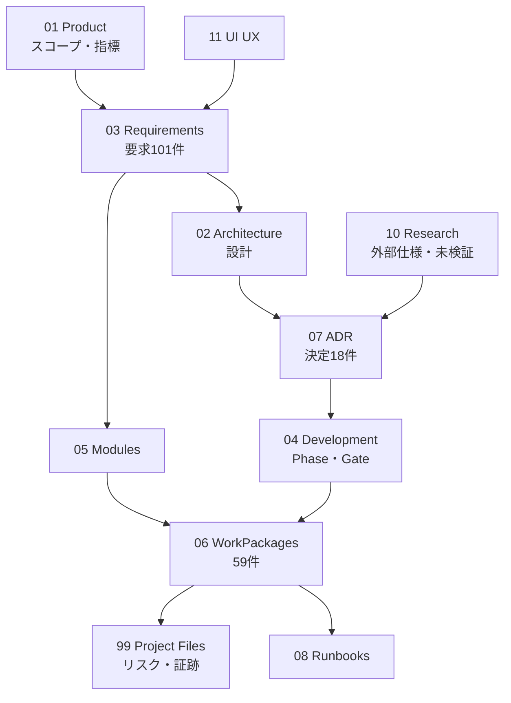

# Project Map

## 文書間の関係

## 正本の所在

| 対象 | 正本 |
|---|---|
| スコープと非対象 | [[01.5_Scope_and_Non_Goals]] |
| 成功指標 | [[01.8_Success_Metrics]] |
| 要求(登録簿) | [[03.1_Requirements_Baseline]] |
| 要求(詳細・受入基準) | `03_Requirements`のカテゴリ別ノート |
| 追跡(要求⇔WP⇔ADR⇔Test) | [[03.18_Requirements_Traceability_Matrix]] |
| 設計判断 | [[07.0_ADR_Index]]と各ADR |
| テナント分離 | [[02.18_Organization_Data_Model_and_RLS]] |
| 特権実行 | [[02.16_Executor_Command_Contract]] |
| 監査 | [[02.17_Audit_Event_Catalog]] |
| 脅威 | [[02.14_Threat_Model]] |
| 実行順序 | [[06.0_WorkPackage_Register]] |
| 合否条件 | [[04.22_Gate_Definitions]] |
| テスト種別 | [[04.16_Test_Strategy]] |
| 画面仕様 | [[11.2_Information_Architecture]] |
| Codex規則 | ルート`AGENTS.md` |
| 未決定事項 | [[00.7_Open_Questions]] |
| 用語 | [[00.5_Glossary]] |

同じ決定を複数箇所へコピーせず、派生ノートから正本へリンクします([[00.4_Document_Governance]])。

## カテゴリ索引

- 索引: [[00.1_Start_Here]] [[00.2_Reading_Order]] [[00.4_Document_Governance]] [[00.5_Glossary]] [[00.6_Decision_Register]] [[00.7_Open_Questions]] [[00.8_Status_Dashboard]]
- 製品: [[01.1_Product_Vision]] [[01.5_Scope_and_Non_Goals]] [[01.8_Success_Metrics]] [[01.10_Naming_and_Brand]]
- 設計: [[02.1_Architecture_Overview]] [[02.14_Threat_Model]] [[02.16_Executor_Command_Contract]] [[02.17_Audit_Event_Catalog]] [[02.18_Organization_Data_Model_and_RLS]]
- 要求: [[03.1_Requirements_Baseline]] [[03.18_Requirements_Traceability_Matrix]] [[03.19_Migration_and_Audit_Requirements]]
- 開発: [[04.1_Master_Roadmap]] [[04.16_Test_Strategy]] [[04.19_Definition_of_Ready_and_Done]] [[04.22_Gate_Definitions]]
- WP: [[06.0_WorkPackage_Register]] [[06.1_Dependency_Map]] [[06.2_Evidence_Index]] [[06.3_GitHub_Issue_Conversion_Guide]]
- 決定: [[07.0_ADR_Index]]
- 運用: [[08.2_Backup_and_Restore_Runbook]] [[08.6_SOLVI_Run_Failure]] [[08.13_Break_Glass_Runbook]]
- テンプレート: [[09.1_ADR_Template]] [[09.2_WorkPackage_Template]] [[09.9_Runbook_Template]]
- UI: [[11.2_Information_Architecture]] [[11.13_Mockup_Asset_Index]]
- 管理: [[99.3_Risk_Register]] [[99.7_Environment_and_Integration_Inventory]] [[99.12_Codex_First_Prompt]] [[99.13_Vault_Validation_Report]]

## 全ノート索引

リンク到達性を確保するための機械生成索引です。`draft`の文書は実装根拠に使えません([[00.4_Document_Governance]])。

### 00_Index

[[00.1_Start_Here]] / [[00.2_Reading_Order]] / [[00.3_Project_Map]] / [[00.4_Document_Governance]] / [[00.5_Glossary]] / [[00.6_Decision_Register]] / [[00.7_Open_Questions]] / [[00.8_Status_Dashboard]]

### 01_Product

[[01.10_Naming_and_Brand]](draft) / [[01.1_Product_Vision]](draft) / [[01.2_Problem_Statement]](draft) / [[01.3_Product_Principles]](draft) / [[01.4_Target_Users_and_Personas]](draft) / [[01.5_Scope_and_Non_Goals]] / [[01.6_Service_Model]](draft) / [[01.7_Value_Proposition]](draft) / [[01.8_Success_Metrics]] / [[01.9_Adoption_and_Change]](draft)

### 02_Architecture

[[02.10_Workflow_and_Outbox]](draft) / [[02.11_Integration_Architecture]](draft) / [[02.12_Deployment_Architecture]](draft) / [[02.13_Observability]](draft) / [[02.14_Threat_Model]] / [[02.15_Backup_DR_and_Continuity]](draft) / [[02.16_Executor_Command_Contract]] / [[02.17_Audit_Event_Catalog]] / [[02.18_Organization_Data_Model_and_RLS]] / [[02.1_Architecture_Overview]] / [[02.2_System_Context]](draft) / [[02.3_Container_Architecture]](draft) / [[02.4_Domain_Architecture]](draft) / [[02.5_Data_Architecture]](draft) / [[02.6_Security_Architecture]](draft) / [[02.7_Executor_Boundary]](draft) / [[02.8_AI_Architecture]](draft) / [[02.9_Identity_and_Access]](draft)

### 03_Requirements

[[03.10_AI_Requirements]] / [[03.11_Security_Requirements]] / [[03.12_Operations_Performance_Requirements]] / [[03.13_UX_Accessibility_Requirements]] / [[03.14_Maintainability_Requirements]] / [[03.15_Use_Case_Catalog]] / [[03.16_Data_Retention_and_Privacy]] / [[03.17_Acceptance_Test_Strategy]] / [[03.18_Requirements_Traceability_Matrix]] / [[03.19_Migration_and_Audit_Requirements]] / [[03.1_Requirements_Baseline]] / [[03.2_Business_and_Stakeholder_Requirements]] / [[03.3_Ticket_Requirements]] / [[03.4_Knowledge_Requirements]] / [[03.5_Catalog_and_Approval_Requirements]] / [[03.6_Automation_Executor_Requirements]] / [[03.7_Identity_OIDC_SCIM_Requirements]] / [[03.8_Asset_CMDB_Requirements]] / [[03.9_Change_Management_Requirements]]

### 04_Development

[[04.10_Phase_8_Plan]] / [[04.11_Phase_9_Plan]] / [[04.12_Environment_Strategy]](draft) / [[04.13_Branch_PR_Strategy]](draft) / [[04.14_CI_CD_Quality_Gates]](draft) / [[04.15_Release_and_Operations_Strategy]](draft) / [[04.16_Test_Strategy]] / [[04.17_Secure_Development_Lifecycle]](draft) / [[04.18_Codex_Operating_Model]](draft) / [[04.19_Definition_of_Ready_and_Done]] / [[04.1_Master_Roadmap]] / [[04.20_Migration_and_Cutover_Strategy]](draft) / [[04.21_Pilot_Strategy]](draft) / [[04.22_Gate_Definitions]] / [[04.2_Phase_0_Plan]] / [[04.3_Phase_1_Plan]] / [[04.4_Phase_2_Plan]] / [[04.5_Phase_3_Plan]] / [[04.6_Phase_4_Plan]] / [[04.7_Phase_5_Plan]] / [[04.8_Phase_6_Plan]] / [[04.9_Phase_7_Plan]]

### 05_Modules

[[05.10_Entra_Graph_Connector]](draft) / [[05.11_SCIM_Service_Provider]](draft) / [[05.12_Asset_CMDB_Lite]](draft) / [[05.13_Change_Management]](draft) / [[05.14_SOLVI_Assist]](draft) / [[05.15_Notification]](draft) / [[05.16_Audit_and_Evidence]](draft) / [[05.17_Search]](draft) / [[05.18_Admin_Settings]](draft) / [[05.1_SOLVI_Portal]](draft) / [[05.2_SOLVI_Ops]](draft) / [[05.3_Ticket_Core]](draft) / [[05.4_Knowledge_Management]](draft) / [[05.5_Service_Catalog]](draft) / [[05.6_Approval]](draft) / [[05.7_Workflow_Orchestration]](draft) / [[05.8_SOLVI_Run_Executor]](draft) / [[05.9_Okta_Connector]](draft)

### 06_WorkPackages

[[06.0_WorkPackage_Register]] / [[06.1_Dependency_Map]] / [[06.2_Evidence_Index]] / [[06.3_GitHub_Issue_Conversion_Guide]] / [[WP-P0-ARCH-002]] / [[WP-P0-DEV-005]] / [[WP-P0-GOV-001]] / [[WP-P0-REQ-004]] / [[WP-P0-SEC-003]] / [[WP-P0-UX-006]] / [[WP-P1-AUD-004]] / [[WP-P1-BCK-007]] / [[WP-P1-CI-006]] / [[WP-P1-DATA-002]] / [[WP-P1-IDM-003]] / [[WP-P1-OBS-005]] / [[WP-P1-PLAT-001]] / [[WP-P2-COLLAB-004]](draft) / [[WP-P2-GATE-007]](draft) / [[WP-P2-NTF-005]](draft) / [[WP-P2-OPS-003]](draft) / [[WP-P2-PORTAL-002]](draft) / [[WP-P2-SEARCH-006]](draft) / [[WP-P2-SLO-008]] / [[WP-P2-TKT-001]](draft) / [[WP-P3-AI-004]](draft) / [[WP-P3-KNW-001]](draft) / [[WP-P3-LINK-003]](draft) / [[WP-P3-MIG-005]](draft) / [[WP-P3-SRCH-002]](draft) / [[WP-P4-APR-002]] / [[WP-P4-CAT-001]](draft) / [[WP-P4-ENTRA-006]](draft) / [[WP-P4-EXEC-004]] / [[WP-P4-EXEC-008]] / [[WP-P4-EXEC-009]] / [[WP-P4-GATE-007]](draft) / [[WP-P4-OKTA-005]](draft) / [[WP-P4-WF-003]](draft) / [[WP-P5-GROUP-003]](draft) / [[WP-P5-IDP-004]](draft) / [[WP-P5-JML-005]](draft) / [[WP-P5-SCIM-001]](draft) / [[WP-P5-USER-002]](draft) / [[WP-P6-AST-001]](draft) / [[WP-P6-CSV-002]](draft) / [[WP-P6-REC-003]](draft) / [[WP-P6-REL-005]](draft) / [[WP-P6-SYNC-004]](draft) / [[WP-P7-APR-002]](draft) / [[WP-P7-CAL-003]](draft) / [[WP-P7-CHG-001]](draft) / [[WP-P7-PIR-004]](draft) / [[WP-P8-CLS-001]](draft) / [[WP-P8-EVAL-004]](draft) / [[WP-P8-OPS-005]](draft) / [[WP-P8-RAG-002]](draft) / [[WP-P8-SEC-003]](draft) / [[WP-P9-ADP-004]](draft) / [[WP-P9-GATE-005]](draft) / [[WP-P9-MIG-001]](draft) / [[WP-P9-OPS-003]](draft) / [[WP-P9-PAR-002]](draft)

### 07_ADR

[[07.0_ADR_Index]] / [[ADR-0001_Modular_Monolith_First]] / [[ADR-0002_TypeScript_Core_and_Python_AI]] / [[ADR-0003_PostgreSQL_System_of_Record]] / [[ADR-0004_External_Identity_OIDC]] / [[ADR-0005_SCIM_Service_Provider]] / [[ADR-0006_Privileged_Executor_Separation]] / [[ADR-0007_AI_Advisory_Only]] / [[ADR-0008_Transactional_Outbox]] / [[ADR-0009_Append_Only_Audit]] / [[ADR-0010_S3_Compatible_Attachments]] / [[ADR-0011_Postgres_FTS_then_pgvector]] / [[ADR-0012_Defer_Temporal]] / [[ADR-0013_Current_State_Plus_Append_Only_Events]] / [[ADR-0014_No_Custom_Inventory_Agent]] / [[ADR-0015_Organization_Isolation_and_RLS]] / [[ADR-0016_Secret_Management]] / [[ADR-0017_API_and_Webhook_Contract]] / [[ADR-0018_Deployment_Baseline]]

### 08_Runbooks

[[08.10_Audit_Export]](draft) / [[08.11_Data_Reconciliation]](draft) / [[08.12_Security_Incident]](draft) / [[08.13_Break_Glass_Runbook]] / [[08.1_Deployment_Runbook]](draft) / [[08.2_Backup_and_Restore_Runbook]] / [[08.3_SOLVI_Incident_Response]](draft) / [[08.4_OIDC_Outage_Runbook]](draft) / [[08.5_SCIM_Failure_Runbook]](draft) / [[08.6_SOLVI_Run_Failure]] / [[08.7_Executor_Credential_Rotation]](draft) / [[08.8_AI_Kill_Switch]](draft) / [[08.9_Migration_Rollback]](draft)

### 09_Templates

[[09.10_Knowledge_Article_Template]](draft) / [[09.11_Catalog_Item_Template]](draft) / [[09.12_Change_Record_Template]](draft) / [[09.1_ADR_Template]] / [[09.2_WorkPackage_Template]] / [[09.3_GitHub_Issue_Template]](draft) / [[09.4_PR_Template]](draft) / [[09.5_Test_Case_Template]](draft) / [[09.6_UAT_Scenario_Template]](draft) / [[09.7_Risk_Template]](draft) / [[09.8_Decision_Log_Template]](draft) / [[09.9_Runbook_Template]]

### 10_Research

[[10.10_Build_vs_Buy_TCO]](draft) / [[10.1_GLPI_iTop_Community_Constraints]](draft) / [[10.2_Freshservice_Function_Gap]](draft) / [[10.3_OIDC_SCIM_Research]](draft) / [[10.4_Okta_Management_API_Research]](draft) / [[10.5_Microsoft_Graph_Research]](draft) / [[10.6_Workflow_Engine_Research]](draft) / [[10.7_ITSM_Practice_Research]](draft) / [[10.8_AI_for_ITSM_Research]](draft) / [[10.9_PostgreSQL_RLS_and_MultiOrg]](draft)

### 11_UI_UX

[[11.10_Accessibility_and_Content]](draft) / [[11.11_UI_State_and_Error_Model]](draft) / [[11.12_UI_Roadmap_and_Test]](draft) / [[11.13_Mockup_Asset_Index]] / [[11.1_UI_Strategy]](draft) / [[11.2_Information_Architecture]] / [[11.3_Design_System]](draft) / [[11.4_User_Portal_Mockup]](draft) / [[11.5_Request_Flow]](draft) / [[11.6_Incident_Flow]](draft) / [[11.7_Admin_Dashboard_Mockup]](draft) / [[11.8_Ticket_Management_Mockup]](draft) / [[11.9_Admin_Settings_Mockup]]

### 99_Project_Files

[[99.10_Budget_and_TCO_Model]](draft) / [[99.11_Codex_Handoff]](draft) / [[99.12_Codex_First_Prompt]] / [[99.13_Vault_Validation_Report]] / [[99.1_Project_Charter]](draft) / [[99.2_Assumptions_and_Constraints]](draft) / [[99.3_Risk_Register]] / [[99.4_Decision_Log]](draft) / [[99.5_RACI]](draft) / [[99.6_Communication_and_Meeting_Cadence]](draft) / [[99.7_Environment_and_Integration_Inventory]] / [[99.8_Migration_Inventory]](draft) / [[99.9_Evidence_and_Audit_Plan]](draft)

### assets

[[README]]
