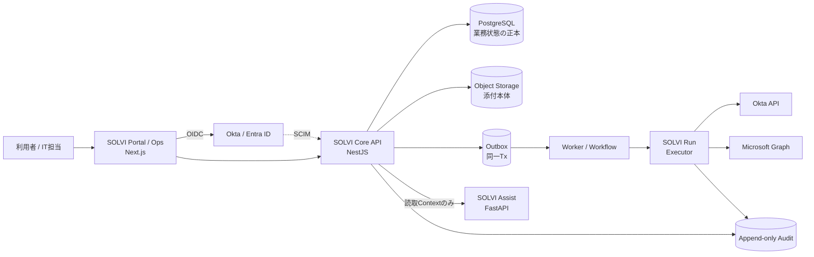

# Architecture Overview

## 1. 全体像

SOLVIはモジュラーモノリスのCore APIを中心に、AIと特権実行だけを別プロセスへ分離した構成をとる([[ADR-0001_Modular_Monolith_First]])。



## 2. コンポーネントの責務と信頼境界

| コンポーネント | 責務 | 保持しないもの | 信頼境界 |
|---|---|---|---|
| Portal / Ops (Next.js) | 表示と入力。認可判定は行わない | 業務ロジック、秘密情報 | ブラウザ=信頼しない |
| Core API (NestJS) | 業務ロジック、認可判定、状態遷移、監査書込み、Outbox書込み | 特権API資格情報 | 認証済みユーザ単位 |
| PostgreSQL | 業務状態の正本、RLSによる境界の安全網 | — | アプリ接続ロールは非owner/NOBYPASSRLS |
| Object Storage | 添付本体 | 権限情報(DBが持つ) | 非公開バケット。署名URL≤10分 |
| Outbox(DB内) | 状態変更と原子的に書かれるイベント | 機微情報(参照IDのみ) | Core APIのみ書込み |
| Worker / Workflow | Outbox配送、Workflow状態機械、Command発行と署名 | 特権API資格情報(署名鍵は持つ) | 内部ネットワーク |
| SOLVI Run (Executor) | 署名検証・Allowlist評価・承認再検証・冪等実行・Receipt生成 | 業務ロジック、AIへの経路 | **最重要境界**。専用IAM/専用サブネット |
| SOLVI Assist (AI) | 分類・要約・検索・回答案の生成 | DB接続、Executor経路、特権資格情報 | 非決定的。出力は常に「提案」 |
| Audit Store(DB内+S3アンカー) | append-onlyの証跡 | — | アプリからのUPDATE/DELETE不可 |

## 3. データフローと同期/非同期の境界

**同期(HTTPリクエスト内で完結させるもの)**: 認証、認可判定、業務状態の読み書き、状態遷移、監査書込み、Outbox書込み、添付メタデータ、検索。

**非同期(Outbox経由でWorkerが処理するもの)**: 通知、Workflowの進行、Command発行、外部API呼び出し、AI推論の一部(バッチ)、監査アンカー。

境界の原則: **外部システムへの呼び出しをHTTPリクエスト内で行わない**([[ADR-0008_Transactional_Outbox]])。理由は、DBコミットと外部作用の間で不整合(二重通知・イベント喪失)が生じるため。UIには「処理中」状態を表示し、完了はWorkflow Runの状態で示す。

代表的なフロー(アクセス申請):

```
Portal → Core API: 申請作成(同期)
  └ 同一Tx: request行 + form snapshot(hash) + outbox_event + audit_event
Worker: outbox → Workflow Run開始 → 承認待ち(数日)
承認者 → Core API: 承認(同期。SoD・自己承認を検証)
Worker: 承認成立 → Command生成 + 署名 → Executorへ配送(at-least-once)
Executor: 署名/期限/nonce検証 → Allowlist → 承認再検証(snapshot hash含む) → 冪等INSERT
          → Okta API → Receipt確定 → audit_event
Worker: Receipt → Ticket更新 + 通知
```

## 4. 障害時の整合性回復

| 障害 | 挙動 | 回復 |
|---|---|---|
| Worker停止 | Outboxに滞留。データは失われない | 再起動で順次処理(冪等) |
| Executor停止 | Commandが未配送で待機。二重実行は起きない | 再開後に配送。同一Idempotency Keyで安全 |
| 外部API応答なし | Receiptが`unknown` | **自動再実行しない**。外部状態を読取照合して人間判断([[08.6_SOLVI_Run_Failure]]) |
| AI停止 | 提案機能のみ停止 | 手動運用継続(FR-AI-007) |
| IdP停止 | 新規ログイン不可。既存セッションは有効期限まで | [[08.4_OIDC_Outage_Runbook]] |
| Object Storage障害 | 添付の参照/追加が不可。他機能は継続 | メタデータはDBに残るため復旧後に再参照可能 |
| DB障害 | 全機能停止 | PITR([[08.2_Backup_and_Restore_Runbook]]) |

**Object StorageとDBの整合**: アップロードは「オブジェクト保存 → メタデータ確定」の順とする(逆順では参照切れが発生する)。失敗時に残るのは孤児オブジェクトであり、週次の棚卸しでGCする([[08.11_Data_Reconciliation]])。

## 5. モジュール内の依存方向

```
Portal/Ops → Core API → (Domain Modules) → Repository → PostgreSQL
                     ↘ Outbox → Worker → Executor → 外部API
                     ↘ AI(読取Contextのみ。逆方向の呼び出しなし)
```

禁止する依存:
- Domain Module間で他モジュールのテーブルへ直接SQLアクセスすること(アプリケーションサービス経由のみ)
- Core APIから外部管理API(Okta/Graph)を直接呼ぶこと
- AIサービスからCore DBまたはExecutorへ接続すること
- UIからDBへ直接アクセスすること

これらはArchitecture Test(TL-16)で機械的に検査する。

## 6. 将来のサービス分割条件

[[ADR-0001_Modular_Monolith_First]]のFollow-upに定義: ①独立スケールが必要 ②デプロイ頻度が他の3倍以上 ③チームが分かれる — のうち2つを満たしたモジュールについて、後継ADRで分割を判断する。それまで分割しない。

## 7. ローカルと本番の差異

| 項目 | ローカル | 本番 |
|---|---|---|
| 実行基盤 | Docker Compose | ECS on Fargate([[ADR-0018_Deployment_Baseline]]) |
| DB | PostgreSQLコンテナ | RDS PostgreSQL(Multi-AZ、PITR) |
| Object Storage | MinIO | S3(VPC Endpoint) |
| Secret | .env(gitignore) | Secrets Manager([[ADR-0016_Secret_Management]]) |
| IdP | Oktaテストテナント | Okta/Entra本番テナント |

差異はContract Testと同一イメージのdigest昇格で吸収する。差異一覧は[[99.7_Environment_and_Integration_Inventory]]で管理する。

## 8. 関連

[[02.16_Executor_Command_Contract]] / [[02.17_Audit_Event_Catalog]] / [[02.18_Organization_Data_Model_and_RLS]] / [[02.14_Threat_Model]] / [[07.0_ADR_Index]]
