# Work Package Dependency Map

[[06.0_WorkPackage_Register]]の`Depends on`から生成。循環依存0、Phase逆転0を機械検証済み。

## Dependency Graph

```mermaid
flowchart LR
  WP_P0_GOV_001 --> WP_P0_ARCH_002
  WP_P0_ARCH_002 --> WP_P0_SEC_003
  WP_P0_GOV_001 --> WP_P0_REQ_004
  WP_P0_ARCH_002 --> WP_P0_REQ_004
  WP_P0_SEC_003 --> WP_P0_REQ_004
  WP_P0_ARCH_002 --> WP_P0_DEV_005
  WP_P0_REQ_004 --> WP_P0_DEV_005
  WP_P0_GOV_001 --> WP_P0_UX_006
  WP_P0_REQ_004 --> WP_P0_UX_006
  WP_P0_DEV_005 --> WP_P1_PLAT_001
  WP_P1_PLAT_001 --> WP_P1_DATA_002
  WP_P1_DATA_002 --> WP_P1_IDM_003
  WP_P1_DATA_002 --> WP_P1_AUD_004
  WP_P1_PLAT_001 --> WP_P1_OBS_005
  WP_P1_AUD_004 --> WP_P1_OBS_005
  WP_P1_PLAT_001 --> WP_P1_CI_006
  WP_P1_DATA_002 --> WP_P1_BCK_007
  WP_P1_DATA_002 --> WP_P2_TKT_001
  WP_P1_AUD_004 --> WP_P2_TKT_001
  WP_P2_TKT_001 --> WP_P2_PORTAL_002
  WP_P1_IDM_003 --> WP_P2_PORTAL_002
  WP_P2_TKT_001 --> WP_P2_OPS_003
  WP_P2_OPS_003 --> WP_P2_REL_009
  WP_P2_TKT_001 --> WP_P2_COLLAB_004
  WP_P2_TKT_001 --> WP_P2_NTF_005
  WP_P1_OBS_005 --> WP_P2_NTF_005
  WP_P2_OPS_003 --> WP_P2_SEARCH_006
  WP_P2_PORTAL_002 --> WP_P2_GATE_007
  WP_P2_OPS_003 --> WP_P2_GATE_007
  WP_P2_REL_009 --> WP_P2_GATE_007
  WP_P2_COLLAB_004 --> WP_P2_GATE_007
  WP_P2_NTF_005 --> WP_P2_GATE_007
  WP_P2_SEARCH_006 --> WP_P2_GATE_007
  WP_P2_SLO_008 --> WP_P2_GATE_007
  WP_P1_OBS_005 --> WP_P2_SLO_008
  WP_P1_DATA_002 --> WP_P3_KNW_001
  WP_P3_KNW_001 --> WP_P3_SRCH_002
  WP_P2_TKT_001 --> WP_P3_LINK_003
  WP_P3_KNW_001 --> WP_P3_LINK_003
  WP_P3_SRCH_002 --> WP_P3_AI_004
  WP_P3_LINK_003 --> WP_P3_AI_004
  WP_P3_KNW_001 --> WP_P3_MIG_005
  WP_P2_TKT_001 --> WP_P4_CAT_001
  WP_P4_CAT_001 --> WP_P4_APR_002
  WP_P4_APR_002 --> WP_P4_WF_003
  WP_P1_AUD_004 --> WP_P4_WF_003
  WP_P4_WF_003 --> WP_P4_EXEC_004
  WP_P0_SEC_003 --> WP_P4_EXEC_004
  WP_P4_EXEC_004 --> WP_P4_EXEC_008
  WP_P4_EXEC_004 --> WP_P4_EXEC_009
  WP_P4_EXEC_008 --> WP_P4_OKTA_005
  WP_P4_EXEC_009 --> WP_P4_OKTA_005
  WP_P4_EXEC_008 --> WP_P4_ENTRA_006
  WP_P4_EXEC_009 --> WP_P4_ENTRA_006
  WP_P4_OKTA_005 --> WP_P4_GATE_007
  WP_P4_ENTRA_006 --> WP_P4_GATE_007
  WP_P1_DATA_002 --> WP_P5_SCIM_001
  WP_P5_SCIM_001 --> WP_P5_USER_002
  WP_P5_SCIM_001 --> WP_P5_GROUP_003
  WP_P5_USER_002 --> WP_P5_GROUP_003
  WP_P5_USER_002 --> WP_P5_IDP_004
  WP_P5_GROUP_003 --> WP_P5_IDP_004
  WP_P5_IDP_004 --> WP_P5_JML_005
  WP_P1_DATA_002 --> WP_P6_AST_001
  WP_P6_AST_001 --> WP_P6_CSV_002
  WP_P6_AST_001 --> WP_P6_REC_003
  WP_P6_CSV_002 --> WP_P6_REC_003
  WP_P6_REC_003 --> WP_P6_SYNC_004
  WP_P4_ENTRA_006 --> WP_P6_SYNC_004
  WP_P6_SYNC_004 --> WP_P6_REL_005
  WP_P6_AST_001 --> WP_P7_CHG_001
  WP_P7_CHG_001 --> WP_P7_APR_002
  WP_P4_APR_002 --> WP_P7_APR_002
  WP_P7_CHG_001 --> WP_P7_CAL_003
  WP_P7_APR_002 --> WP_P7_PIR_004
  WP_P7_CAL_003 --> WP_P7_PIR_004
  WP_P2_TKT_001 --> WP_P8_CLS_001
  WP_P3_AI_004 --> WP_P8_RAG_002
  WP_P3_SRCH_002 --> WP_P8_RAG_002
  WP_P8_RAG_002 --> WP_P8_SEC_003
  WP_P0_SEC_003 --> WP_P8_SEC_003
  WP_P8_CLS_001 --> WP_P8_EVAL_004
  WP_P8_RAG_002 --> WP_P8_EVAL_004
  WP_P8_SEC_003 --> WP_P8_EVAL_004
  WP_P8_EVAL_004 --> WP_P8_OPS_005
  WP_P3_MIG_005 --> WP_P9_MIG_001
  WP_P6_REL_005 --> WP_P9_MIG_001
  WP_P7_PIR_004 --> WP_P9_MIG_001
  WP_P9_MIG_001 --> WP_P9_PAR_002
  WP_P9_PAR_002 --> WP_P9_OPS_003
  WP_P1_BCK_007 --> WP_P9_OPS_003
  WP_P9_PAR_002 --> WP_P9_ADP_004
  WP_P9_OPS_003 --> WP_P9_GATE_005
  WP_P9_ADP_004 --> WP_P9_GATE_005
```

## 並行実行可能な単位(同一Phase内で依存のないWP)

| Phase | 並行着手可能 |
|---|---|
| P0 | WP-P0-GOV-001 |
| P1 | WP-P1-PLAT-001 |
| P2 | WP-P2-TKT-001, WP-P2-SLO-008 |
| P3 | WP-P3-KNW-001 |
| P4 | WP-P4-CAT-001 |
| P5 | WP-P5-SCIM-001 |
| P6 | WP-P6-AST-001 |
| P7 | WP-P7-CHG-001 |
| P8 | WP-P8-CLS-001, WP-P8-RAG-002 |
| P9 | WP-P9-MIG-001 |

## クリティカルパス

P0(GOV→ARCH→SEC→REQ→DEV) → P1(PLAT→DATA→AUD) → P2(TKT→OPS) → P4(CAT→APR→WF→EXEC-004→EXEC-008→OKTA→GATE) → P9(MIG→PAR→OPS→GATE)

このパス上のWPが遅延すると全体が遅延する。特にWP-P1-DATA-002(Organization/RLS)は後続の大半の前提であり、着手前に[[02.18_Organization_Data_Model_and_RLS]]の確定が必要。
